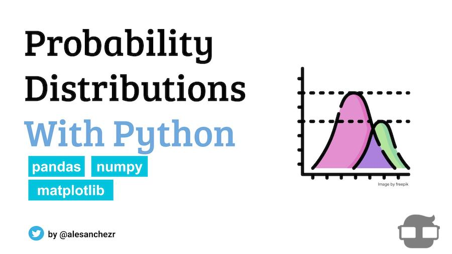

# Probability Distribution Exercises with Python

[](https://github.com/4GeeksAcademy/gperdrizet-probability-distribution-exercises-project-with-python/actions/workflows/codespaces/create_codespaces_prebuilds)

A comprehensive probability theory and statistics project focused on working with discrete and continuous probability distributions using Python, SciPy, and statistical visualization. This project demonstrates essential statistical computing techniques through practical exercises with binomial, normal, and uniform distributions.




## Project Overview

This project explores fundamental concepts in probability theory and statistics through hands-on exercises with three key probability distributions: **binomial** (discrete), **normal** (continuous), and **uniform** (continuous). The project provides practical experience with:

- Statistical function implementation using SciPy
- Probability density and cumulative distribution functions
- Quantile functions and random variable generation
- Object-oriented programming for statistical distributions
- Data visualization of probability distributions
- Statistical analysis and interpretation


## Getting Started

### Option 1: GitHub Codespaces (Recommended)

1. **Fork the Repository**
   - Click the "Fork" button on the top right of the GitHub repository page
   - 4Geeks students: set 4GeeksAcademy as the owner - 4Geeks pays for your codespace usage. All others, set yourself as the owner
   - Give the fork a descriptive name. 4Geeks students: I recommend including your GitHub username to help in finding the fork if you loose the link
   - Click "Create fork"
   - 4Geeks students: bookmark or otherwise save the link to your fork

2. **Create a GitHub Codespace**
   - On your forked repository, click the "Code" button
   - Select "Create codespace on main"
   - If the "Create codespace on main" option is grayed out - go to your codespaces list from the three-bar menu at the upper left and delete an old codespace
   - Wait for the environment to load (dependencies are pre-installed)

3. **Start Working**
   - Open `notebooks/assignment.ipynb` in the Jupyter interface
   - Follow the step-by-step instructions in the notebook

### Option 2: Local Development

1. **Prerequisites**
   - Git
   - Python >= 3.10

2. **Fork the repository**
   - Click the "Fork" button on the top right of the GitHub repository page
   - Optional: give the fork a new name and/or description
   - Click "Create fork"

3. **Clone the repository**
   - From your fork of the repository, click the green "Code" button at the upper right
   - From the "Local" tab, select HTTPS and copy the link
   - Run the following commands on your machine, replacing `<LINK>` and `<REPO_NAME>`

   ```bash
   git clone <LINK>
   cd <REPO_NAME>
   ```

4. **Set Up Environment**

   ```bash
   python -m venv venv
   source venv/bin/activate
   pip install -r requirements.txt
   ```

5. **Launch Jupyter & start the notebook**
   ```bash
   jupyter notebook notebooks/assignment.ipynb
   ```


## Project Structure

```
├── .devcontainer/        # Development container configuration
├── assets/               # Images and other files
│
├── notebooks/            # Jupyter notebook directory
│   ├── assignment.ipynb  # Assignment notebook with exercises
│   └── solution.ipynb    # Complete solution notebook
│
├── .gitignore            # Files/directories not tracked by git
├── requirements.txt      # Python dependencies
└── README.md             # Project documentation
```


## Distributions Covered

### Binomial Distribution
A discrete probability distribution that models the number of successes in a fixed number of independent trials, each with the same probability of success (e.g., coin flips).

**Key Functions Implemented:**
- `dbinom()`: Probability mass function (point estimates)
- `pbinom()`: Cumulative distribution function
- `qbinom()`: Quantile function (inverse CDF)
- `rbinom()`: Random variable generation

### Normal Distribution
A continuous probability distribution that is symmetric about the mean, showing that data near the mean are more frequent than data far from the mean.

### Uniform Distribution
A continuous probability distribution where all outcomes in a given range are equally likely to occur.


## Learning Objectives

1. **Statistical Computing**: Implement probability functions using SciPy.stats
2. **Object-Oriented Design**: Create reusable distribution classes
3. **Data Visualization**: Generate publication-quality statistical plots
4. **Random Sampling**: Generate and analyze random variables from distributions
5. **Statistical Analysis**: Calculate probabilities, quantiles, and cumulative distributions
6. **Code Organization**: Structure statistical code for reusability and clarity


## Technologies Used

- **Python 3.11**: Core programming language
- **SciPy**: Scientific computing and statistical distributions
- **NumPy**: Numerical computing and array operations
- **Matplotlib**: Statistical visualization and plotting
- **Jupyter**: Interactive development environment


## Contributing

This is an educational project. Contributions for improving the statistical analysis, adding new distributions, or enhancing visualizations are welcome:

1. Fork the repository
2. Create a feature branch
3. Make your changes
4. Submit a pull request
